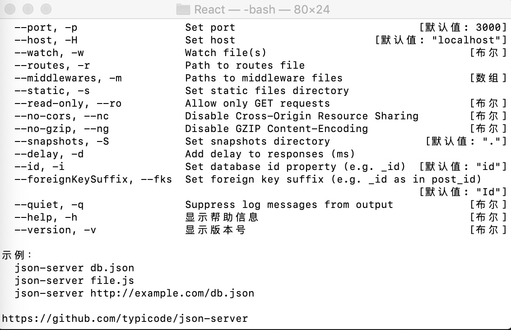

## 1. 使用 json-server 快速搭建本地数据接口, 模拟API数据

* [具体方法](https://github.com/dongxiaomin/React_Demo/blob/master/json_server.md)

test


--------------------------


## 2. 使用 jquery 或 axios 请求 API

### 2.1 使用 jquery

#### 引入 Jquery

安装: ` npm i jquery -S `

引入: ` import $ from  'jquery' `

按需导入，只导入 getJSON: ` import  { getJSON } from 'jquery' `


#### 例子
```
    $.getJSON("http://localhost:3004/recordss").then(
        // response => console.log(response),
        response => this.setState({
            records: response,
            isLoaded: true
        }),
        error => this.setState({
            error: error.statusText,
            isLoaded: true
        })
    )
```

### 2.2 使用 axios

#### 引入 axios

安装: `npm install axios`

引入: `import axios from 'axios'`

#### 例子

```
    axios.get("http://localhost:3004/recordss").then(
        response => this.setState({
            records: response.data,
            isLoaded: true
        })
    ).catch(
        // error => console.log(error)
        error => this.setState({
            error: error.message,
            isLoaded: true
        })
    )
```


## 3. 静态类型检查

### 引入 prop-types

安装: `npm install prop-types --save`

引入: `import PropTypes from 'prop-types'`

## 4. 通过使用环境变量，来改造 API

创建环境变量

`REACT_APP_test` 开头

引用 

`process.env.REACT_APP_test` 

---------------

## 遇到问题

1. es6 扩展运算语句，下面两者相同

`{id: record.id} {date: record.date} {title: record.title} {amount: record.amount}`

` {...record}`

2. 
查看端口占用进程: `sudo lsof -i :3000`

结束相应进程: `sudo kill -9 12297`

重启服务 `npm stop` `npm start`


-----------


This project was bootstrapped with [Create React App](https://github.com/facebook/create-react-app).

## Available Scripts

In the project directory, you can run:

### `npm start`

Runs the app in the development mode.<br />
Open [http://localhost:3000](http://localhost:3000) to view it in the browser.

The page will reload if you make edits.<br />
You will also see any lint errors in the console.

### `npm test`

Launches the test runner in the interactive watch mode.<br />
See the section about [running tests](https://facebook.github.io/create-react-app/docs/running-tests) for more information.

### `npm run build`

Builds the app for production to the `build` folder.<br />
It correctly bundles React in production mode and optimizes the build for the best performance.

The build is minified and the filenames include the hashes.<br />
Your app is ready to be deployed!

See the section about [deployment](https://facebook.github.io/create-react-app/docs/deployment) for more information.

### `npm run eject`

**Note: this is a one-way operation. Once you `eject`, you can’t go back!**

If you aren’t satisfied with the build tool and configuration choices, you can `eject` at any time. This command will remove the single build dependency from your project.

Instead, it will copy all the configuration files and the transitive dependencies (webpack, Babel, ESLint, etc) right into your project so you have full control over them. All of the commands except `eject` will still work, but they will point to the copied scripts so you can tweak them. At this point you’re on your own.

You don’t have to ever use `eject`. The curated feature set is suitable for small and middle deployments, and you shouldn’t feel obligated to use this feature. However we understand that this tool wouldn’t be useful if you couldn’t customize it when you are ready for it.

## Learn More

You can learn more in the [Create React App documentation](https://facebook.github.io/create-react-app/docs/getting-started).

To learn React, check out the [React documentation](https://reactjs.org/).

### Code Splitting

This section has moved here: https://facebook.github.io/create-react-app/docs/code-splitting

### Analyzing the Bundle Size

This section has moved here: https://facebook.github.io/create-react-app/docs/analyzing-the-bundle-size

### Making a Progressive Web App

This section has moved here: https://facebook.github.io/create-react-app/docs/making-a-progressive-web-app

### Advanced Configuration

This section has moved here: https://facebook.github.io/create-react-app/docs/advanced-configuration

### Deployment

This section has moved here: https://facebook.github.io/create-react-app/docs/deployment

### `npm run build` fails to minify

This section has moved here: https://facebook.github.io/create-react-app/docs/troubleshooting#npm-run-build-fails-to-minify
