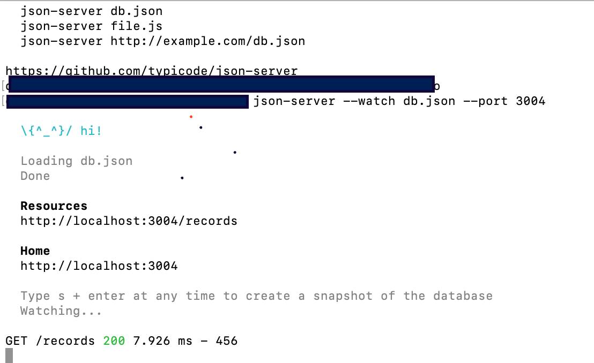
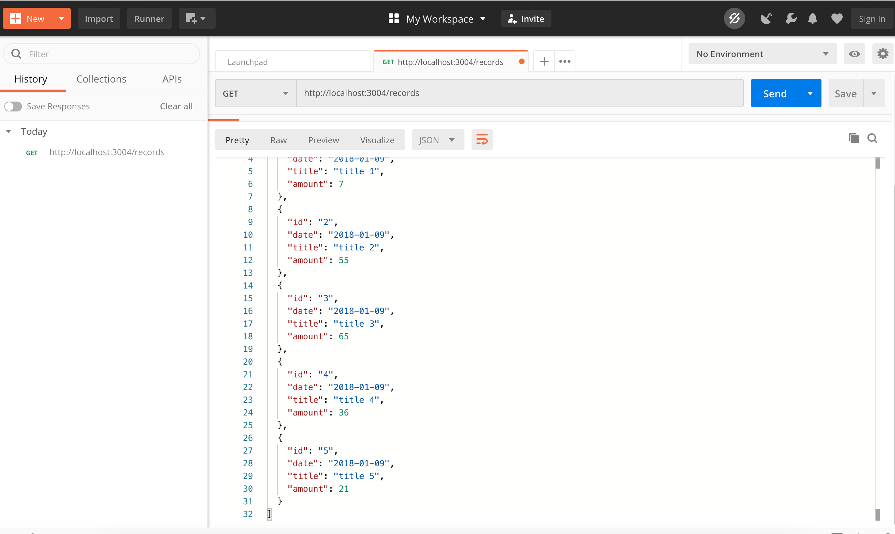
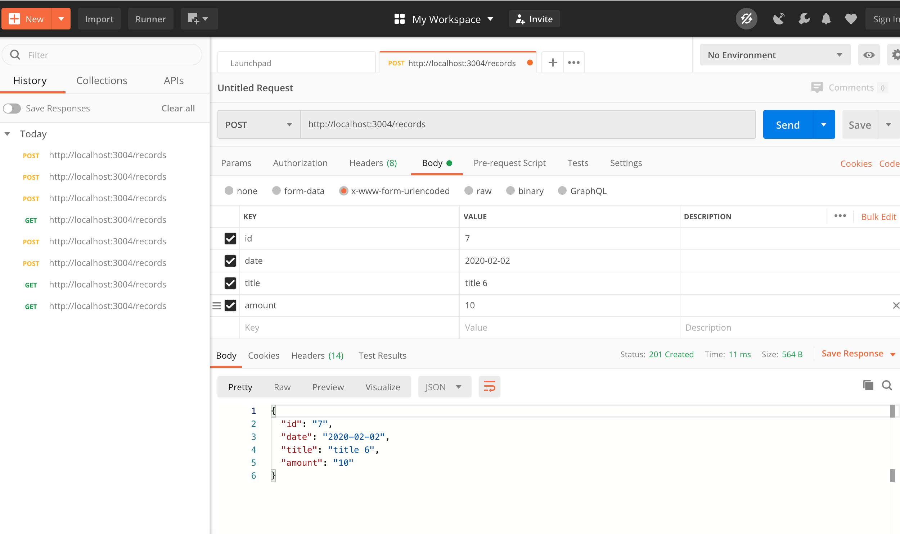
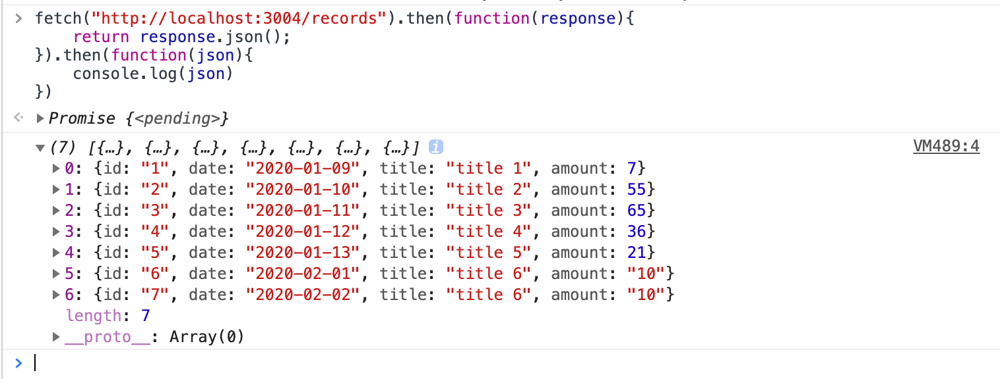

## 使用 json-server 快速搭建本地数据接口, 模拟API数据

### 1. 下载 postman
https://www.postman.com/

### 2. 安装 json server

Window: `npm install -g json-server`

IOS: `sudo  npm  install  -g json-server`

### 3. 测试 

`json-server -h `

如果出现下面内容，表明安装成功！


### 4. 根目录新建 db.json，复制一些数据

```
 {
     "records": 
        [
            {
            "id": "1",
            "date": "2020-01-09",
            "title": "title 1",
            "amount": 7
            }
        ]
 }
```

### 5. 进入当前目录,监听3004端口

`json-server --watch db.json --port 3004`




### 6. 打开 postman,发送 http://localhost:3004/records, 拿到数据




### 7. 增加一条数据，用 post 请求，同时db.json 会增加一条数据



### 8. 控制台验证数据，显示出数据

fetch 为 浏览器自带的方法
用 fetch 来获取 API 的数据
``` 
fetch("http://localhost:3004/records").then(function(response){
    return response.json();
}).then(function(json){
    console.log(json)
})
```




### 9. 重启 Server

`json-server --watch db.json --port 3004`


---------------------------------
